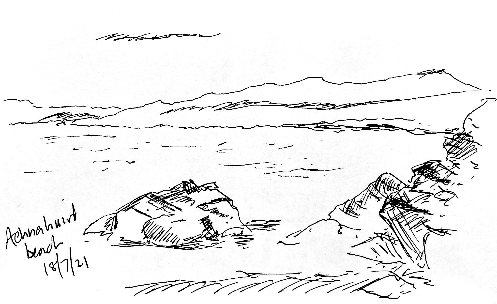

# Stories and images

**Achnahaird beach**, sketch *en plein air*, Mont Blanc fountain pen

Storytelling is one of man's oldest cultural habits, and the evidence we have for this is in the images our ancestors left behind. From the earliest cave paintings to the *insta* trophy, we record from imagination and experience the world around us. Photography is the ubiquitous manifestation of this in much of the contemporary world we inhabit, so much so that the art of capturing images might seem trivial. In these pages are some of my own images, with perhaps some thoughts or stories to go with them using my powerful ally, words. Here I have the advantage over the cave painter: I can express or explain context to help the observer make sense of the image on the screen. You are at liberty to make your own mind up, of course, and you should critically engage.

## About me

My name is Nick Hood. Jack of All, Master of None and perpetually frustrated by that. I have had the privilege of enjoying travel and adventure in my various careers, and have picked up more tricks than scars on the way. Born with a fast brain and a slightly faster mouth, I have on occasion had to move on but always, I hope, with sense of humour intact.

## This place

There are sometimes stories to go with pictures I make. I wanted to try to make a space where I can, if I can find the time, tell the stories of the images. Or maybe post the images of the stories. Whatever. This is one of those places, although I am increasingly eschewing the digital spaces I have (over)inhabited. Anyway, I hope you enjoy it. Thanks for stopping by.

Nick Hood  
Fife

p.s. the bridge photo? That was taken by my wife. She is [a better photographer than I am](https://wildaye.co.uk/).
